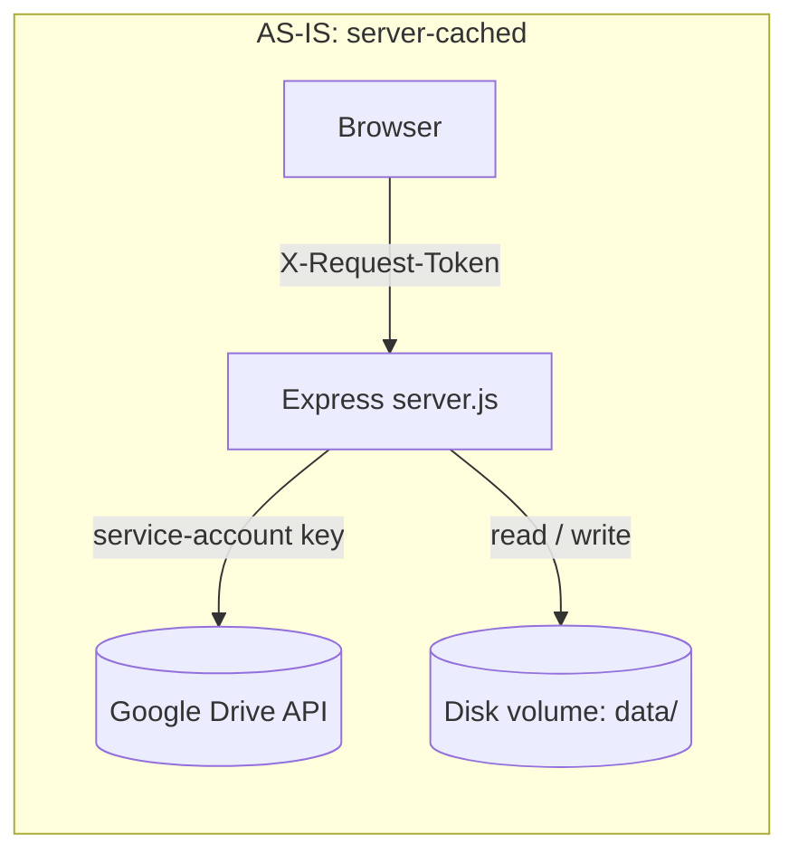
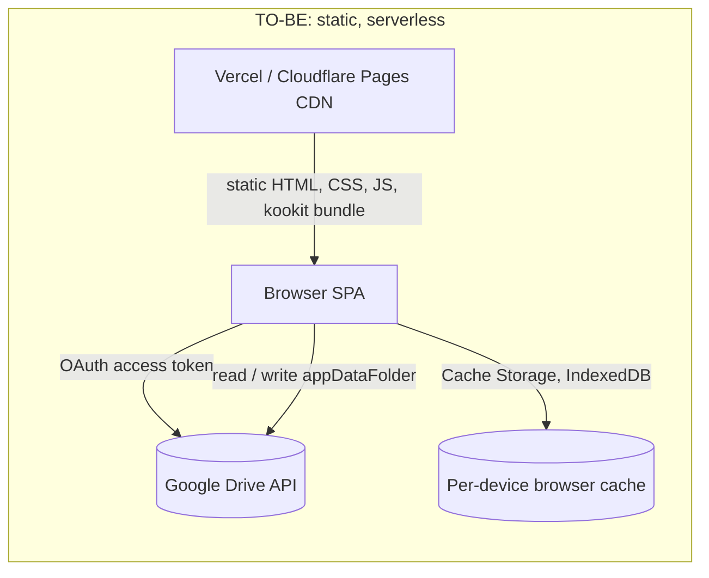

# Software Requirements Specification
## eonzArchive — Migration from Server-Cached Deployment to Serverless Static Application

| Field | Value |
|---|---|
| Document type | Software Requirements Specification (SRS) |
| Target system | `eonzArchive` (github.com/Faizur00/eonzArchive) |
| Version | 1.0 |
| Status | Draft for review |
| Date | 2026-09-10 |
| Baseline commit reviewed | `main`, 18 commits, license AGPL-3.0 |

This SRS follows the structure of IEEE 830 / ISO-IEC-IEEE 29148, adapted for a single-repository personal application. Every functional requirement (FR) and non-functional requirement (NFR) has a unique ID for traceability. Requirement keywords follow this rule: **must** marks a mandatory requirement, **should** marks a recommended requirement, **can** marks an optional requirement.

---

## Table of Contents

1. Introduction
2. Overall Description
3. System Architecture
4. Functional Requirements
5. Non-Functional Requirements
6. Data Schemas
7. Interface Contracts
8. Migration and Decommissioning Requirements
9. Acceptance Criteria
10. Traceability Matrix
11. Risks and Open Items

---

## 1. Introduction

### 1.1 Purpose

This document states the exact requirements for `eonzArchive` version 2. Version 2 replaces the current Node.js server and its persistent disk store with a static, serverless application. This document defines what the new system must do. It does not give a build tutorial or a task list.

### 1.2 Scope

`eonzArchive` is a personal e-book library and reader. It connects to one Google Drive folder, lists the books in it, and renders them in the browser with the bundled `kookit` render engine. Version 1 runs this logic on a Node.js server with a mounted disk volume. Version 2 must run the same logic as static files plus browser code, with no server process and no persistent disk.

This document covers:
- The functional behavior the new system must keep or add.
- The non-functional constraints of a static, serverless deployment.
- The data schemas that replace the current on-disk JSON files.
- The interface contracts between the browser app and Google Drive.
- The steps needed to retire the current server-based components.

This document does not cover:
- A native mobile app.
- Multi-user or shared-library support (the system stays single-user, personal use).
- A redesign of the `kookit` render engine or its supported book formats.
- A choice between Vercel and Cloudflare Pages. Both must work from the same static build.

### 1.3 Definitions, Acronyms, and Abbreviations

| Term | Meaning |
|---|---|
| SRS | Software Requirements Specification, this document |
| SPA | Single-page application |
| FR / NFR | Functional requirement / Non-functional requirement |
| OAuth | Open standard for delegated account access |
| PKCE | Proof Key for Code Exchange, an OAuth security extension for public clients |
| GIS | Google Identity Services, Google's client-side auth library |
| CDN | Content delivery network |
| CSP | Content-Security-Policy, an HTTP header that restricts what a page can load or run |
| `appDataFolder` | A hidden Google Drive space, private to one app and one Google account |
| LRU | Least recently used, an eviction rule for a cache |
| CORS | Cross-Origin Resource Sharing, the browser rule that controls cross-domain requests |
| AS-IS | The current, version 1 system, described in Section 2.1 |
| TO-BE | The target, version 2 system, specified in the rest of this document |

### 1.4 References

- Current source tree: `github.com/Faizur00/eonzArchive`, files `server.js`, `src/services/*.js`, `src/utils/gdriveHelper.js`, `web/js/*.js`, `kookit/*`.
- Google Drive API v3 reference (`files.list`, `files.get`, `files.create`, `files.update`).
- Google Identity Services documentation for OAuth 2.0 with PKCE.
- Vercel and Cloudflare Pages static-site deployment documentation.

### 1.5 Assumptions and Dependencies

- A1: The Google Drive API allows a browser page to call `files.list` and `files.get` directly with an `Authorization: Bearer` header from an authorized JavaScript origin. This assumption needs a short spike to confirm CORS behavior for range requests (see Risk R1 in Section 11).
- A2: The Google Cloud OAuth consent screen can stay in "Testing" publish status, with the owner listed as the only test user. This avoids Google's app-verification process for the `drive.readonly` scope, because the app has one user.
- A3: The end user always reads the archive from a browser that supports IndexedDB, the Cache Storage API, and ES2020 JavaScript.
- A4: `kookit` keeps working unchanged, because it already takes a raw file buffer as input and has no server dependency (confirmed by reading `web/js/reader.js`, which fetches a buffer and calls `Kookit.BookHelper.getRendition(buffer, config, Kookit)`).

---

## 2. Overall Description

### 2.1 Current System (AS-IS)

The current system is a single Node.js/Express process (`server.js`) plus a static `web/` folder plus the vendored `kookit` render library. Findings from the reviewed source:

- **Auth to Google Drive**: a Google **service account** key (JSON, from an env var or a key file), scope `drive.readonly`, held only by the server (`src/services/driveService.js`).
- **Library sync**: `DriveService.sync()` runs a full breadth-first traversal of the configured Drive folder on every sync call, and writes the result to `data/library.json` on local disk.
- **Book cache**: `CacheService` downloads a book's bytes from Drive on first read and writes them to `data/cache/books/` on local disk. Later reads serve the cached file, with HTTP Range support for partial reads.
- **Annotations**: `AnnotationService` stores one JSON file per book under `data/annotations/`, holding highlights and drawings.
- **Client-server security**: because the server holds a powerful, long-lived secret, it adds two custom defenses: a per-boot random `API_TOKEN` that every `/api/*` call must send in an `X-Request-Token` header, and a `Host` header allowlist to block DNS-rebinding attacks.
- **Deployment**: a `Dockerfile` plus `docker-compose.yml` that bind-mounts `./data` into the container. This bind mount is the reason the app needs a host with a persistent, writable disk. It cannot run on a platform that only serves static files or that resets its filesystem between requests.
- **Frontend**: a hash-routed vanilla-JS SPA (`web/js/router.js`, `library.js`, `reader.js`, `annotations.js`, `state.js`, `api.js`) that calls the Express API and hands book buffers to `kookit` for rendering.

### 2.2 Product Perspective (TO-BE)

Version 2 keeps the same frontend rendering logic (`kookit`, the reader UI, the library UI) and replaces every piece that currently needs a live server or a local disk:

| AS-IS component | Needs a server because... | TO-BE replacement |
|---|---|---|
| Service-account key in `driveService.js` | A private key must stay secret, off the client | Per-user OAuth 2.0 with PKCE, no secret in the bundle |
| `data/library.json` on disk | Needs a place to persist the crawl result | Browser IndexedDB, plus a copy in Drive `appDataFolder` |
| `data/cache/books/` on disk | Needs a place to cache downloaded bytes | Browser Cache Storage API, per device |
| `data/annotations/*.json` on disk | Needs a durable store for user notes | JSON files in Drive `appDataFolder`, synced across devices |
| `API_TOKEN` + Host allowlist | Protects the server's secret and its local API | Not needed. There is no server secret and no server API to protect |
| `Dockerfile` + `docker-compose.yml` | Needs a container with a mounted volume | A static build folder, deployed to a CDN |

### 2.3 Product Functions (Summary)

1. Sign in with a personal Google account and grant read-only Drive access.
2. Set and change the Drive folder that holds the library.
3. Scan the folder tree and list books, with search, format filter, cached-only filter, and sort.
4. Read a book in the browser with `kookit`, across every format the current system supports.
5. Highlight text and draw on pages, and keep those notes across devices.
6. Manage the local book cache: view its size, clear one book, clear everything.
7. Deploy the whole app as static files, at zero hosting cost, to Vercel or Cloudflare Pages.

### 2.4 User Characteristics

One user role: the owner of the Google account and the archive. No admin role, no guest role, no shared login. The user is comfortable pasting a Drive folder link and running a one-time OAuth consent flow.

### 2.5 Constraints

- C1: The app must run at $0 recurring cost, inside the free tier of Vercel or Cloudflare Pages, and inside Google's free Drive API quota.
- C2: The app must not run any long-lived server process. A build step during deployment is allowed. A server-side runtime that answers user requests is not.
- C3: The project stays under the AGPL-3.0 license already in the repository. The `kookit` dependency is AGPL-3.0-or-later. The source must stay public.
- C4: The app must not store a Google service-account key, a client secret, or any other long-lived credential in the repository or in the deployed bundle.

### 2.6 Architecture Decision Record: Drive Access Model

**Decision**: use per-user OAuth 2.0 with PKCE through Google Identity Services, requesting the `drive.readonly` and `drive.appdata` scopes, called directly from the browser. No proxy function, no service account.

**Reason**: a static app on Vercel or Cloudflare Pages has nowhere safe to keep a service-account private key. A serverless function could hold that key, but adding a function back into the design works against the goal of a plain static application, and it adds a component that must be paid for once free-tier request limits are passed. Per-user OAuth removes the secret entirely, because each user's access token is short-lived and scoped to that user's own files.

**Alternative considered and rejected for this version**: keep the service account, move it into a Vercel Serverless Function or a Cloudflare Pages Function. This still works within a free tier, but it keeps a component that must be redeployed, monitored, and updated, which the user did not ask for. Section 11 (R2) notes this as a fallback if Assumption A1 fails.

---

## 3. System Architecture

### 3.1 Component Diagram





### 3.2 Hardware / Software Boundaries

| Boundary | AS-IS | TO-BE |
|---|---|---|
| Compute | A host running Node.js 20, always on | None. Static files only, served by the CDN |
| Storage | A mounted disk volume (`./data`) | None owned by the app. Google Drive holds the data of record. The browser holds a local, disposable cache |
| Network entry point | The server's own port (3000), reached by IP or a reverse proxy | The CDN's edge network (HTTPS by default on both platforms) |
| Build toolchain | `npm ci`, run inside the `Dockerfile` | `npm ci` plus a bundler (for example Vite or esbuild) and the existing `kookit` Rollup build, run once at deploy time, not at request time |
| External systems | Google Drive API v3, reached with a service-account credential | Google Drive API v3 and Google Identity Services, reached with a per-user OAuth token |
| Runtime environment | Any machine that can run Docker or Node.js 20 | Any browser with ES2020, IndexedDB, and the Cache Storage API |

### 3.3 External Interfaces

- **Google Drive API v3**: `files.list`, `files.get` (metadata and `alt=media`), `files.create`, `files.update`. Called directly from the browser with a bearer token.
- **Google Identity Services**: browser-side OAuth 2.0 Authorization Code flow with PKCE. Issues the access token used for every Drive API call.
- **Hosting platform (Vercel or Cloudflare Pages)**: serves the static build output. Reads a small, static header-configuration file for the Content-Security-Policy (Section 5, NFR-SEC-4). Runs no application code at request time.

---

## 4. Functional Requirements

### 4.1 Authentication and Authorization (FR-AUTH)

| ID | Requirement |
|---|---|
| FR-AUTH-1 | The system must let the user sign in with a Google account through OAuth 2.0 with PKCE, using Google Identity Services. |
| FR-AUTH-2 | The system must request only the `drive.readonly` and `drive.appdata` scopes. It must not request write access to the user's general Drive space. |
| FR-AUTH-3 | The system must keep the access token in memory only, for the life of the page. It must not write the access token to `localStorage`, `sessionStorage`, or a cookie. |
| FR-AUTH-4 | The system must renew the access token in the background before it expires, without a full page reload. |
| FR-AUTH-5 | The system must give a sign-out control that revokes the local token and clears all in-memory session state. |
| FR-AUTH-6 | The system must not include a Google service-account key, a private key, or an OAuth client secret in the deployed bundle or in the source repository. |

### 4.2 Library Configuration and Sync (FR-LIB)

| ID | Requirement |
|---|---|
| FR-LIB-1 | The system must let the user set the archive folder by pasting a Google Drive folder URL or a raw folder ID, in the same formats `extractFolderId()` already parses. |
| FR-LIB-2 | The system must store the configured folder ID in browser local storage, keyed to the signed-in account. |
| FR-LIB-3 | The system must scan the configured folder tree with `files.list`, using a breadth-first traversal, the same field list, and the same page size as the current `DriveService.sync()` method. |
| FR-LIB-4 | The system must classify each file into a supported book format using the same extension and MIME-type tables as `getBookFormat()` and `isSupportedBook()`. |
| FR-LIB-5 | The system must cache the resulting library index (folders, books, other files, stats, last sync time) in IndexedDB, and must also write a copy to the Drive `appDataFolder`, so a new device can load an existing index without a full re-scan. |
| FR-LIB-6 | The system must let the user trigger a manual re-sync at any time. |
| FR-LIB-7 | The system must run an automatic sync on first sign-in if no cached index exists yet, in IndexedDB or in `appDataFolder`. |
| FR-LIB-8 | The system must support search, format filter, cached-only filter, and sort (name, size ascending, size descending, date), matching the current `/api/files` query parameters. |

### 4.3 Book Retrieval, Caching, and Reading (FR-BOOK)

| ID | Requirement |
|---|---|
| FR-BOOK-1 | The system must download book content directly from Drive with `files.get?alt=media` and the user's access token. It must not route this call through a proxy server. |
| FR-BOOK-2 | The system must store a downloaded book's bytes in the browser's Cache Storage API, keyed by file ID, so a repeat read does not re-download the file. |
| FR-BOOK-3 | The system must let the user view total cache size, clear the cache for one book, and clear the whole cache, matching the current cache-stats and clear-cache actions. |
| FR-BOOK-4 | The system must evict the least recently used cached book (LRU) when the browser's storage-quota estimate is close to its limit. |
| FR-BOOK-5 | The system must pass the retrieved book buffer to the existing `kookit` render engine unchanged, so every current format (EPUB, MOBI, AZW3, PDF, TXT, MD, DOCX, FB2, CBR, CBZ, CBT, CB7, HTML, XHTML, MHTML) keeps working. |
| FR-BOOK-6 | The system should use the HTTP `Range` header on the `files.get` request for large PDF files, where Assumption A1 (Section 1.5) holds. Where it does not hold, the system must fall back to a full download. |

### 4.4 Annotation Management (FR-ANNOT)

| ID | Requirement |
|---|---|
| FR-ANNOT-1 | The system must store one JSON file per book's annotations in the Drive `appDataFolder`, named by file ID, using the schema in Section 6.4. |
| FR-ANNOT-2 | The system must support: get all annotations for a book, replace the full list, upsert one annotation, and delete one annotation by ID, matching the current annotation API. |
| FR-ANNOT-3 | The system must set `createdAt` on first save of an annotation and update `updatedAt` on every later save, matching the fields in `AnnotationService.upsertAnnotation()`. |
| FR-ANNOT-4 | The system must queue a failed annotation write and retry it, so a short network drop does not lose a highlight or a drawing. |

### 4.5 Build and Deployment (FR-DEPLOY)

| ID | Requirement |
|---|---|
| FR-DEPLOY-1 | The build must produce one static output folder with no server-side runtime code. |
| FR-DEPLOY-2 | The build must embed the Google OAuth Client ID as a build-time constant. The build must not embed a secret value, because a public OAuth Client ID for a browser app is not secret by design. |
| FR-DEPLOY-3 | The system must deploy on Vercel's free Hobby tier or on Cloudflare Pages' free tier, using each platform's default static-site build settings, with no paid add-on. |
| FR-DEPLOY-4 | The deployment guide must state the exact "Authorized JavaScript origins" value to set on the OAuth Client ID, matching the deployed domain. |
| FR-DEPLOY-5 | The build must ship a Content-Security-Policy through the platform's static header configuration (a `vercel.json` `headers` entry, or a Cloudflare Pages `_headers` file), because no server middleware exists to set headers at request time. |

---

## 5. Non-Functional Requirements

### 5.1 Performance

- NFR-PERF-1: a full library scan must not take more than twice the time of the current server-side `DriveService.sync()` call, measured on the same folder and the same network.
- NFR-PERF-2: a cached book must open in `kookit` with no network call, once FR-BOOK-2 has stored it.

### 5.2 Security

- NFR-SEC-1: the codebase and the deployed bundle must hold no long-lived secret (service-account key, client secret, static API token).
- NFR-SEC-2: the app must run over HTTPS only. This is the default on both target platforms and must not be turned off.
- NFR-SEC-3: OAuth scopes must follow least privilege, limited to `drive.readonly` and `drive.appdata` (FR-AUTH-2).
- NFR-SEC-4: the app must set a Content-Security-Policy that blocks inline script execution outside the app's own bundle, because a static app has no server-side middleware to add defense in depth at request time.

### 5.3 Reliability

- NFR-REL-1: a Drive API rate-limit response or an outage must show a clear retry option. It must not show a blank or crashed screen.
- NFR-REL-2: a failed annotation write must stay visible as a pending or failed state until it succeeds, matching FR-ANNOT-4. It must not fail silently.

### 5.4 Portability

- NFR-PORT-1: the static build output must deploy unchanged to both Vercel and Cloudflare Pages, with no platform-specific server code.
- NFR-PORT-2: the app must not depend on a paid-tier-only feature of either platform.

### 5.5 Cost

- NFR-COST-1: total monthly hosting cost must be $0 under normal personal-use traffic, using only the free tiers named in FR-DEPLOY-3 and Google's free Drive API quota.

### 5.6 Usability

- NFR-USE-1: sign-in must take no more than two user actions: open the consent screen, grant access.
- NFR-USE-2: page-turn, search, and highlight behavior in the reader must not regress from the current version, because `kookit`'s rendering code does not change (Assumption A4).

### 5.7 Maintainability

- NFR-MAINT-1: `kookit` should stay a vendored, unmodified dependency, so future updates can be pulled from the upstream `koodo-reader` project without a merge conflict.

### 5.8 Licensing

- NFR-LIC-1: the project must keep the AGPL-3.0 license and a public source repository link, because `eonzArchive` and its embedded `kookit` dependency are both licensed AGPL-3.0(-or-later).

---

## 6. Data Schemas

All schemas below replace the equivalent on-disk JSON structure in the AS-IS system. Field names match the current code where a like-for-like field exists.

### 6.1 Folder Record

```json
{
  "id": "string, Google Drive file ID",
  "name": "string",
  "parentId": "string, Google Drive file ID",
  "path": "string, e.g. /Fiction/Sci-Fi",
  "modifiedTime": "string, ISO 8601",
  "webViewLink": "string, URL"
}
```

### 6.2 Book (File) Record

```json
{
  "id": "string, Google Drive file ID",
  "name": "string",
  "parentId": "string, Google Drive file ID",
  "parentPath": "string",
  "path": "string",
  "mimeType": "string",
  "size": "number, bytes",
  "sizeFormatted": "string, e.g. 4.2 MB",
  "modifiedTime": "string, ISO 8601",
  "md5Checksum": "string or null",
  "format": "string, one of EPUB | MOBI | AZW3 | AZW | PDF | TXT | MD | DOCX | FB2 | CBR | CBZ | CBT | CB7 | HTML | XHTML | MHTML | UNKNOWN",
  "isBook": "boolean",
  "webViewLink": "string, URL",
  "thumbnailLink": "string or null",
  "iconLink": "string or null"
}
```

### 6.3 Library Index (IndexedDB record and `appDataFolder` snapshot)

```json
{
  "rootFolder": { "id": "string", "name": "string" },
  "folders": [ "Folder Record, see 6.1" ],
  "books": [ "Book Record, see 6.2" ],
  "otherFiles": [ "Book Record shape, isBook: false" ],
  "stats": {
    "totalBooks": "number",
    "totalFolders": "number",
    "totalSizeBytes": "number",
    "totalSizeFormatted": "string"
  },
  "lastSyncTime": "string, ISO 8601, or null"
}
```

### 6.4 Annotation Record (one JSON file per book, in `appDataFolder`)

```json
{
  "id": "string, unique within the book",
  "fileId": "string, Google Drive file ID of the book",
  "type": "string, highlight | drawing",
  "color": "string, e.g. color-0",
  "range": "string, JSON-encoded CFI or coordinate data",
  "selectedText": "string or empty",
  "chapterDocIndex": "number or undefined",
  "format": "string, book format at time of creation",
  "createdAt": "number, epoch milliseconds",
  "updatedAt": "number, epoch milliseconds"
}
```

### 6.5 Session State (in memory only, never persisted)

```json
{
  "accessToken": "string, short-lived OAuth token",
  "expiresAt": "number, epoch milliseconds",
  "accountEmail": "string, for display only"
}
```

---

## 7. Interface Contracts

### 7.1 Google Drive API Calls

| Call | Purpose | Scope needed | Replaces |
|---|---|---|---|
| `files.get` (metadata) | Read root folder name and confirm access | `drive.readonly` | `DriveService.getStatus()` |
| `files.list` | Breadth-first folder and file crawl | `drive.readonly` | `DriveService.sync()` |
| `files.get?alt=media` | Download book bytes | `drive.readonly` | `/api/book/:id/stream`, `DriveService.getBookFile()` |
| `files.create` (in `appDataFolder`) | Write a new annotation file or the index snapshot | `drive.appdata` | `AnnotationService.saveAnnotations()`, index write in FR-LIB-5 |
| `files.update` (media) | Overwrite an existing annotation file or index snapshot | `drive.appdata` | `AnnotationService.upsertAnnotation()` |
| `files.list` (in `appDataFolder`) | Find an existing annotation file or index snapshot by name | `drive.appdata` | `AnnotationService.getAnnotations()` |

### 7.2 Internal Browser Module Interface

No REST API exists in the TO-BE system. The table below states the responsibility that replaces each AS-IS Express route.

| AS-IS route | TO-BE module responsibility |
|---|---|
| `GET /api/status` | Auth module reports sign-in state and root-folder access |
| `POST /api/sync` | Library module runs `files.list` traversal, writes IndexedDB and `appDataFolder` |
| `GET /api/library` | Library module reads the cached index from IndexedDB |
| `GET /api/files` | Library module filters and sorts the cached index in memory |
| `GET /api/book/:id/info` | Library module looks up one book record, checks local cache presence |
| `POST /api/book/:id/cache` | Cache module downloads and stores one book, on demand |
| `DELETE /api/book/:id/cache` | Cache module deletes one entry from Cache Storage |
| `GET /api/cache/stats` | Cache module reads total size from Cache Storage / quota estimate |
| `DELETE /api/cache` | Cache module clears all Cache Storage entries for the app |
| `GET /api/book/:id/annotations` | Annotation module reads one JSON file from `appDataFolder` |
| `POST /api/book/:id/annotations` | Annotation module writes one JSON file to `appDataFolder` |
| `DELETE /api/book/:id/annotations/:id` | Annotation module rewrites the JSON file with the entry removed |
| `GET /api/book/:id/stream` | Cache module serves the cached `Blob`, or downloads it first (FR-BOOK-1, FR-BOOK-2) |

### 7.3 Deployment Interface

| Setting | Vercel | Cloudflare Pages |
|---|---|---|
| Build command | `npm run build` | `npm run build` |
| Output directory | `dist/` (or the bundler's configured output) | `dist/` (or the bundler's configured output) |
| Build-time constant | `VITE_GOOGLE_OAUTH_CLIENT_ID` (or the bundler's equivalent env prefix) | Same, set as a Pages environment variable |
| Header configuration file | `vercel.json`, `headers` array | `_headers`, placed in the output directory |
| Server-side function used | None | None |

---

## 8. Migration and Decommissioning Requirements (FR-MIGRATE)

| ID | Requirement |
|---|---|
| FR-MIGRATE-1 | The project must give a one-time, browser-only import tool that reads an exported copy of `data/library.json` and `data/annotations/*.json`, and writes their content into the Drive `appDataFolder` schema (Sections 6.3, 6.4). |
| FR-MIGRATE-2 | The import tool must run fully in the browser. It must not need a server. |
| FR-MIGRATE-3 | After the import tool ships and the user confirms a successful migration, the project must remove `server.js`, `Dockerfile`, `docker-compose.yml`, `src/services/cacheService.js`, `src/services/driveService.js`, `src/services/annotationService.js`, and the `data/` folder from the repository. |
| FR-MIGRATE-4 | The project's `README.md` must be updated to describe the new sign-in flow and remove the `.env` / service-account setup instructions, once FR-MIGRATE-3 is complete. |

---

## 9. Acceptance Criteria

1. A fresh `git clone` of the repository, followed only by `npm install` and `npm run build`, produces a static folder with no server file inside it.
2. Deploying that static folder to a new Vercel project, with only the OAuth Client ID set as a build-time variable, serves a working sign-in screen with no other configuration.
3. The same static folder, deployed to a new Cloudflare Pages project with the same one variable, also serves a working sign-in screen.
4. After sign-in, the app lists the same books, in the same folder structure, as the current server-based version, for the same Drive folder.
5. Opening an EPUB, a PDF, and a CBZ file each renders correctly through `kookit`, matching current behavior.
6. Creating a highlight on one device and reloading the app on a second, signed-in browser shows the same highlight, confirming `appDataFolder` sync (FR-ANNOT-1).
7. `grep` across the deployed bundle and the source repository finds no Google service-account key, no private key block, and no OAuth client secret.
8. The Vercel and Cloudflare Pages billing pages both show $0 owed after a week of normal personal use.

---

## 10. Traceability Matrix

| AS-IS file or component | TO-BE requirement IDs |
|---|---|
| `src/services/driveService.js` (auth, sync, `getBookFile`) | FR-AUTH-1 to FR-AUTH-6, FR-LIB-1 to FR-LIB-8, FR-BOOK-1, FR-BOOK-6 |
| `src/services/cacheService.js` | FR-BOOK-2, FR-BOOK-3, FR-BOOK-4 |
| `src/services/annotationService.js` | FR-ANNOT-1 to FR-ANNOT-4 |
| `src/utils/gdriveHelper.js` (`extractFolderId`, `getBookFormat`, `isSupportedBook`, `formatBytes`) | FR-LIB-1, FR-LIB-4 (logic reused unchanged in the browser module) |
| `server.js` (`API_TOKEN`, Host allowlist, all `/api/*` routes) | Removed. See Section 2.2 table and NFR-SEC-1 |
| `Dockerfile`, `docker-compose.yml`, `data/` volume | Removed. See FR-MIGRATE-3 |
| `web/js/*.js`, `kookit/*` | Kept unchanged, per Assumption A4 and NFR-USE-2 |

---

## 11. Risks and Open Items

| ID | Risk | Impact if it occurs | Fallback |
|---|---|---|---|
| R1 | Google's `alt=media` endpoint may not accept a `Range` header from a browser under CORS for every case. This affects Assumption A1 and FR-BOOK-6. | Large PDF reading falls back to a full download instead of a partial read. | Ship FR-BOOK-6 as a "should", with the full-download path as the required fallback, already stated in the requirement. |
| R2 | If R1 fails in a way that blocks basic reads (not just Range reads), the pure client-only model in Section 2.6 does not work. | The app would need a thin serverless function as a Drive proxy after all. | Fall back to the alternative in Section 2.6: keep a service-account credential, but move it into one Vercel Serverless Function or Cloudflare Pages Function, still inside the free tier. |
| R3 | Google may ask for app verification if the `drive.readonly` scope is later requested by more than a small, fixed list of test users. | Sign-in stops working for any user not on the test list. | Keep the OAuth consent screen in "Testing" status, matching Assumption A2, since this is a single-user personal app. |
| R4 | Browser storage quotas differ across browsers and can be smaller than the current server disk cache. | More frequent cache evictions (FR-BOOK-4) than today. | Accepted trade-off of a serverless, disk-free design. State it plainly to the user rather than hide it. |
